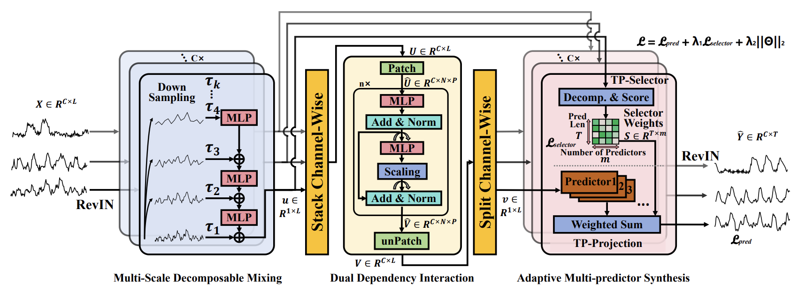

<p align="center">
    
</p>


# Adaptive Multi-Scale Decomposition Framework for Time Series Forecasting

[](https://arxiv.org/abs/2406.03751)

## Overview
The Adaptive Multi-Scale Decomposition Framework (AMD) is a cutting-edge solution for time series forecasting, incorporating three main components: the Multi-Scale Decomposable Mixing (MDM) Block, the Dual Dependency Interaction (DDI) Block, and the Adaptive Multi-predictor Synthesis (AMS) Block.

<p align="center">
    
</p>


```bash
pip install -r requirements.txt
```

\
```
data
├── electricity.csv
├── exchange_rate
├── ETTh1.csv
├── ETTh2.csv
├── ETTm1.csv
├── ETTm2.csv
├── solar_AL.txt
├── traffic.csv
└── weather.csv
```

